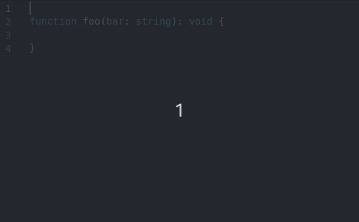

# VS DocBlockr (Visual Studio Code)

A Visual Studio Code port of the Atom package [Docblockr](https://github.com/nikhilkalige/docblockr).

[Extension page](https://marketplace.visualstudio.com/items?itemName=jeremyljackson.vs-docblock)

Currently three languages have been implemented:

* C
* Java
* JavaScript
* PHP
* SCSS
* TypeScript
* Vue.js

More languages to come in the future.

## Usage

Type `/**` above the code you want to apply a docblock too, and press `enter`.

## Settings

Currently the following configuration settings have been implemented:

| Title                    | Description                                               |
|--------------------------|-----------------------------------------------------------|
| Column Spacing           | Minimum number of spaces between columns                  |
| Block Comment Style      | Which doc block comment style to use (`default\|drupal`)  |
| Default return tag       | Whether or not to display a return tag                    |
| \*SCSS Comment Close     | Type of block level comment closing to use                |
| \*SCSS Comment Open      | Type of block level comment opening to use                |
| \*SCSS Comment Separator | Type of block level separator closing to use              |

\* *Note: VS DocBlockr does not currently support autocompletion of SASS blocks with `///`.*

## Acknowledgments

The [language agnostic lexing process](src/lexer.ts) is a stripped down version
of the [Pug Lexer](https://github.com/pugjs/pug-lexer).
